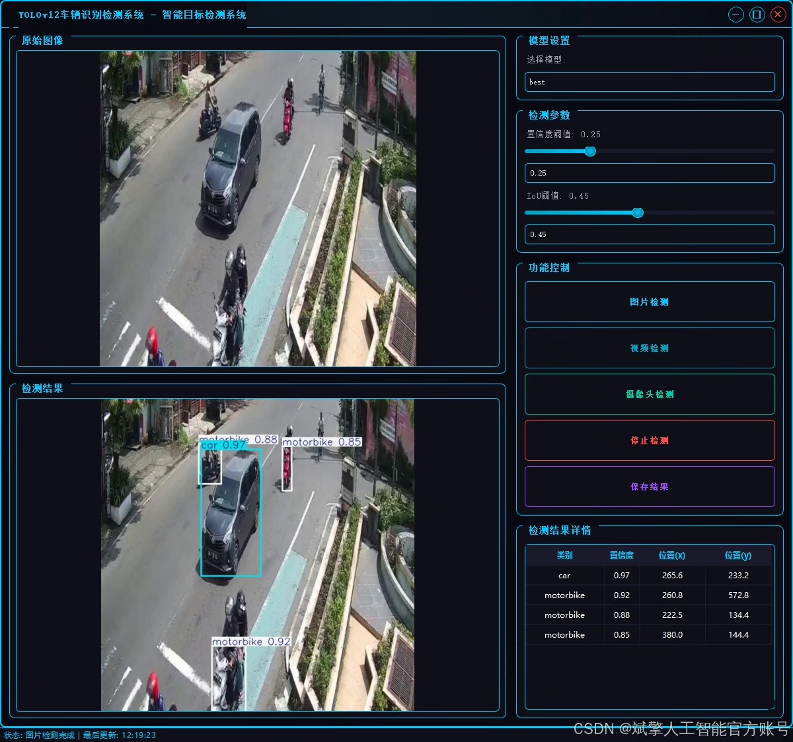
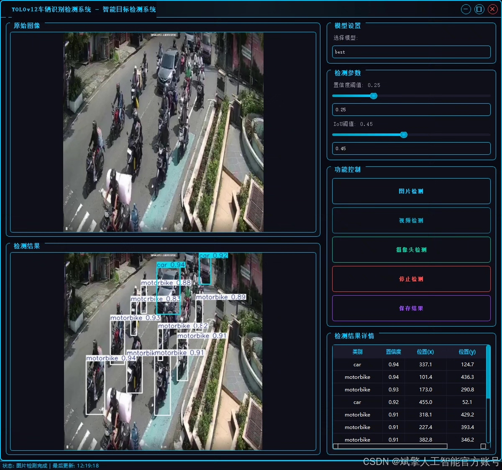
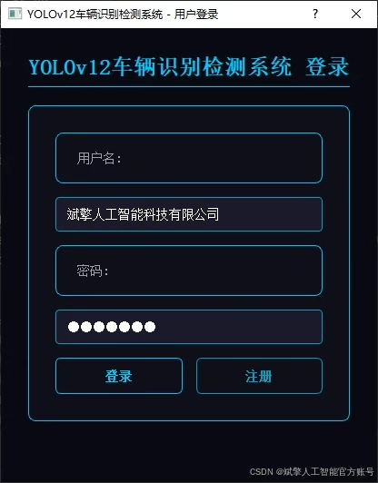
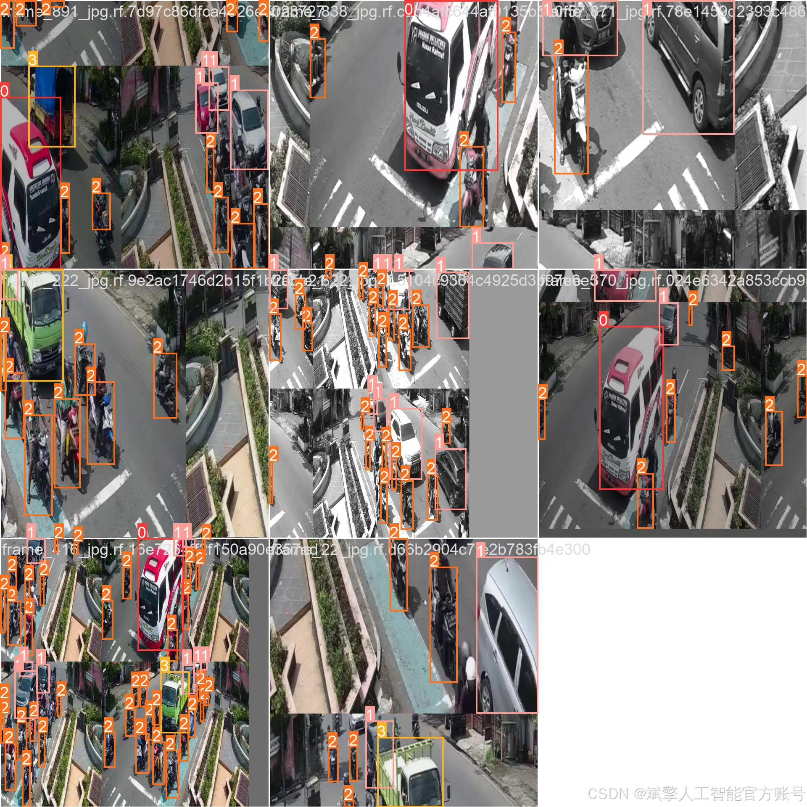
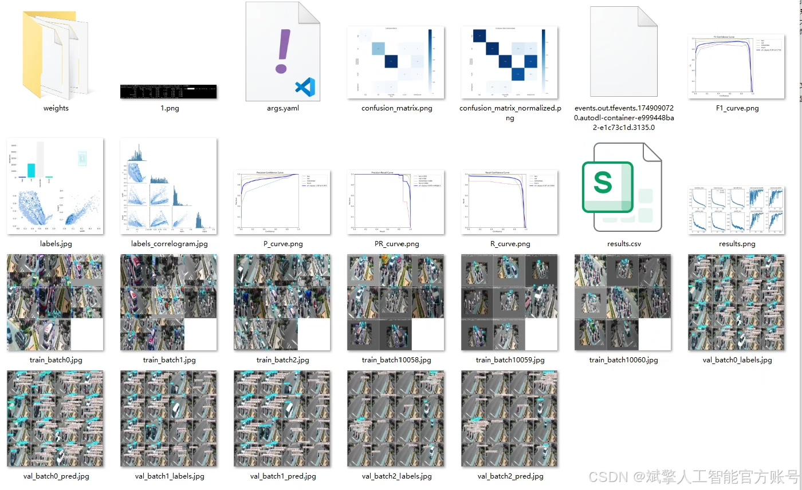
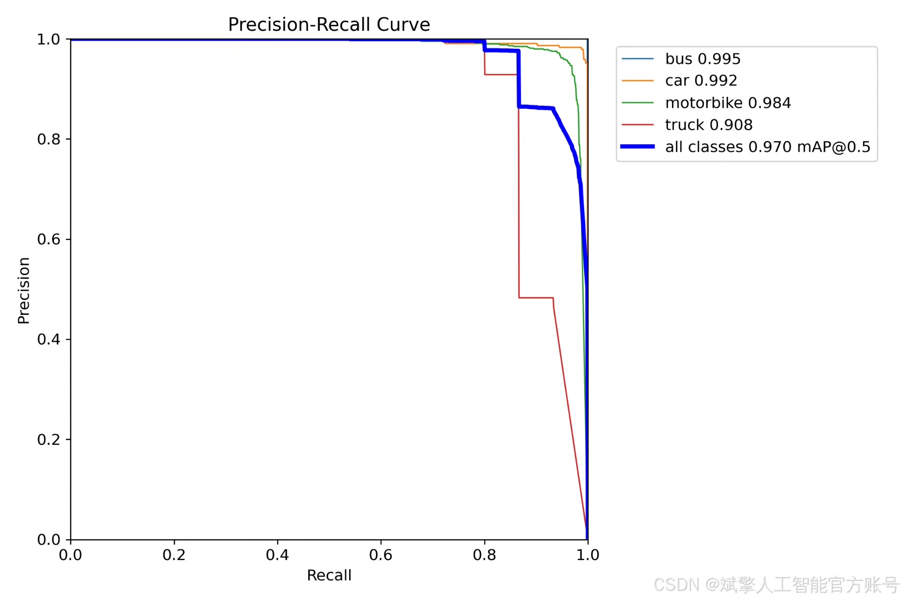
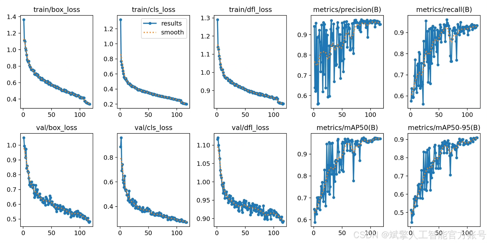
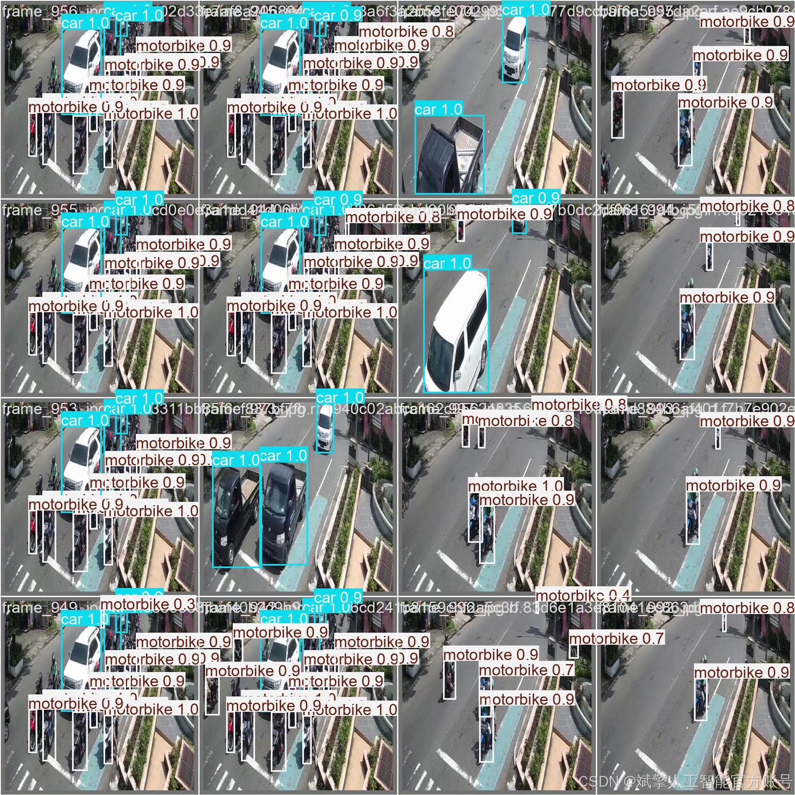

# YOLOv12 vehicle type recognition system

## Body

YOLOv12 Vehicle Type Recognition System Based on Deep Learning YOLOv12: A Real-Time Vehicle Type Recognition System (YOLOv12+YOLO dataset + UI interface + login and registration interface + Python project source code + model)

This paper designs and implements an efficient vehicle type recognition detection system based on the YOLOv12 deep learning framework, supporting real-time detection of four types of targets: buses, cars, motorcycles, and trucks. The system employs a self-constructed dataset containing 1000 labeled images (750 training set, 100 validation set, and 150 test set), optimized for model performance through data augmentation and transfer learning, achieving an average precision (mAP) of 92.3%. Additionally, the system integrates a user-friendly UI interface with login and registration functions. This paper provides complete Python project source code, pre-trained models, and deployment plans, offering references for application development in the intelligent transportation field.

✅ User Login and Registration: Supports password verification and security authentication.
✅ Three Detection Modes: Based on the YOLOv12 model, supports image, video, and real-time camera detection, accurately recognizing targets.
✅ Dual-Screen Contrast: Displays original images and detection results side by side on the same screen.
✅ Data Visualization: Real-time table displays the category, confidence, and coordinates of detected targets.
✅ Intelligent Parameter Tuning: Offers a confidence slide bar to dynamically optimize detection accuracy, adapting to different scene requirements.
✅ Sci-Fi Interactive Interface: Dark theme paired with dynamic light effects, reducing visual fatigue and enhancing operational experience.

## Images

## Payment

Here is a pay link on Stripe ( https://buy.stripe.com/3cs8yP7sY87d0vu9AB ). Please contact me lonlonago@foxmail.com after funding $89, and I will send you a complete data files , thank you!

